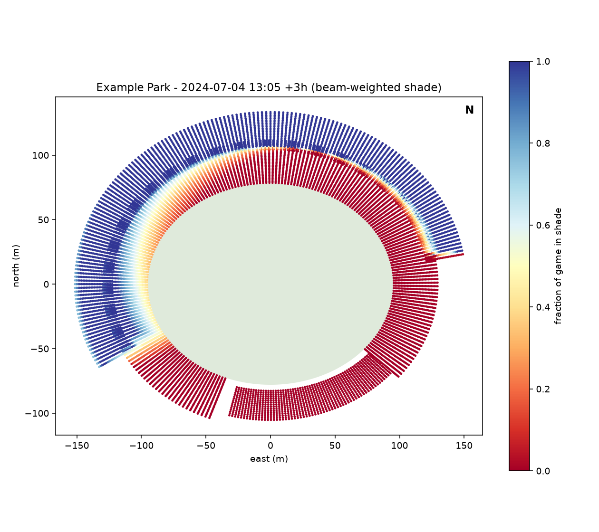
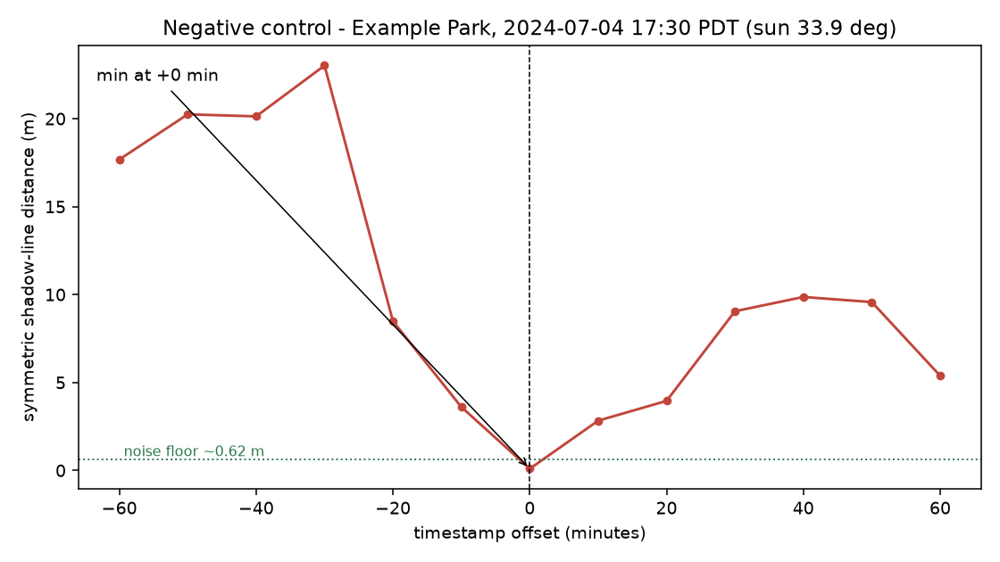

# Shades

Which seat stays in the shade?

Buy a ticket for a 1pm July game and the seat number decides whether you spend
three hours squinting into the sun or sitting in shadow. The stadium knows the
answer and doesn't tell you. Seating charts are built around price tiers and
sightlines. They say nothing about sun.

This works it out from geometry. Give it a stadium's shape and a first-pitch
time, and it traces the sun across the sky minute by minute, works out which
parts of the bowl block it, and scores every seat on how much of the game it
spends in shade.



Every dot is a seat. Blue sat in shade, red sat in the sun. This is a 1:05pm
July game at the example park. The upper deck's front lip cuts a hard line
across the back of the lower bowl, and the bleachers out in the outfield gap,
with nothing above them, take the full three hours.

Two things make the answer less obvious than "sit on the third-base side."

**Not every minute is worth the same.** The sun at 2pm is roughly four times
fiercer than the sun at 6:45pm. A seat shaded for the last hour of a game and
a seat shaded for the first hour can both read "50% shaded" and be nothing
alike. So every minute gets weighted by how strong the beam actually was.

**Shadow blocks only part of the heat.** Being in shadow stops the direct beam,
but about 10 to 20% of clear-sky energy arrives scattered off the whole sky
dome, and shadow leaves that untouched. Only having concrete over your head
helps there. In the example park, 717 seats are in shade for every single
minute of the game, and the energy they absorb still ranges from 51 to
338 Wh/m². A 6.6x spread among seats that all look identical on a shade map.

---

## For anyone who wants to run it

You need Python and the packages in `requirements.txt`.

```
pip install -r requirements.txt
python run_game.py --stadium example_park.yaml --date 2024-07-04 --start 13:05 --hours 3
```

That writes a CSV of every seat with its shade score, and a top-down plot of
the bowl coloured by that score.

A stadium is a YAML file. `example_park.yaml` is a generic open-air ballpark
with numbers good enough to demonstrate the thing and too rough to believe.
Replace them with measurements before trusting any output. Each deck is a ring
described by where it starts, where it ends, how high it sits, and which part
of the circle it covers:

```yaml
decks:
  - name: lower
    inner_a: 95.0        # semi-axis at the front row, metres
    inner_b: 78.0
    inner_z: 1.0         # height of the front edge
    outer_a: 130.0       # and again at the back row
    outer_b: 112.0
    outer_z: 13.0
    rows: 30
    theta_start_deg: -40.0   # leaves an outfield gap
    theta_end_deg: 250.0
```

Set `rows: 0` and a deck becomes a pure occluder, a roof or canopy that shades
people without seating any. Gaps matter as much as structures: the outfield
notch is where the late-afternoon sun gets in.

Getting real numbers for a real venue: Google Earth Pro's ruler for the
footprint and its elevation profile for heights, architect press releases
(Populous, HOK) for deck heights, official seating charts for where each deck
starts and stops.

---

## For people who want to know how it works

Six modules, each doing one thing.

| | |
|---|---|
| `sun.py` | solar position to unit vector |
| `geometry.py` | YAML to seat points and occluder mesh |
| `occlusion.py` | is this seat in shadow right now? |
| `irradiance.py` | how much energy did it actually absorb? |
| `photo_validation.py` | does any of this match reality? |
| `viz.py`, `export.py` | plots, and OBJ export for Blender |

### The sun

`pvlib`'s NREL SPA solver, accurate to ~0.0003°, converted into the local frame
of x east, y north, z up, with the origin at the centre of the field:

$$\vec{s} = (\sin\gamma\cos\alpha,\; \cos\gamma\cos\alpha,\; \sin\alpha)$$

for elevation α and azimuth γ measured clockwise from north.

Timestamps must be timezone-aware; passing naive ones raises rather than
guessing. There is a good reason for the strictness. A DST slip is a one-hour
error, a ~15° azimuth error, and a shadow line in completely the wrong place.
Worse, it surfaces looking like a modelling bug, so you go hunting in the wrong
file.

### The bowl

Each deck is a truncated elliptical cone: an inner edge (front row) and an
outer edge (back row), each an ellipse at a given height, linearly interpolated
between. It produces two things: seat points where people sit, and a triangle
mesh that blocks light. The example park is 10,800 seats and 5,760 triangles.

Seats sit 0.7 m above the deck surface, so a ray leaving a seat doesn't
immediately re-hit the deck it started from.

### Shadows

The question is: fire a ray from a seat toward the sun; does it hit anything?

The direct approach is Möller-Trumbore, every ray against every triangle. It's
correct, easy to check, and O(N·M) in both time and memory. At 10,800 seats
against 5,760 triangles it asks numpy for a 1.4 GiB intermediate and dies.

The trick that makes it fast needs no external dependency. The sun is
effectively at infinity, so every ray is parallel, and you can shear the whole
scene onto the ground plane:

$$\pi(x, y, z) = \left(x - z\frac{s_x}{s_z},\; y - z\frac{s_y}{s_z}\right)$$

Under that map an entire sun ray collapses to a single 2D point, so

> seat is blocked by triangle T ⟺ π(seat) lies inside π(T), and T is above the seat

which turns a 3D ray/triangle test into 2D point-in-triangle, and lets seats
bucket into a uniform grid so each triangle only tests the handful of seats its
shadow could possibly reach. The height test comes back out of the same
barycentric weights, which keeps the result exact.

The brute-force version is still in the tree as `brute_force_hit`, used as a
test oracle. The two agree exactly across sun angles from 5° to 75°. Below
roughly 500 to 800 seats brute force actually wins, since the grid's setup cost
doesn't pay for itself until the scene is big enough.

### Energy

Shade fraction is the naive score: what fraction of minutes was this seat in
shadow. Weighting each minute by direct beam strength gives a better one.

The two rankings mostly agree, at Spearman 0.9994 across 10,800 seats, but
"mostly" hides real movement. The mean seat shifts about 70 places, and the
worst shifts 828.

Absorbed energy adds the part shade leaves alone:

$$\text{load} = \sum_t \left[\text{sunlit}_t \cdot DNI_t \cdot f_p(\alpha_t) + SVF \cdot DHI_t\right]\Delta t$$

`SVF` is the sky view factor: fire rays over the hemisphere and count how many
escape. Open bleachers score near 1.0; a seat tucked under a deck scores far
lower. `f_p` is the Fanger projected-area factor, the fraction of a seated
person presented to the beam. It peaks near 0.3 at low sun and falls off
overhead, which is why "the sun is high" doesn't straightforwardly mean "you
are hotter."

Clear-sky irradiance comes from pvlib's Ineichen model, which needs no API key
and gives an upper bound. For real numbers, NREL NSRDB, PVGIS, or an
EnergyPlus TMY file all drop into the same interface.

### Does it match reality?

A model that looks plausible is worth nothing on its own. The harness for
checking it against photographs is built; **no photographs have been annotated
yet**, so there is no accuracy number to report.

The approach compares model-predicted shadow lines against shadow lines traced
in photographs. Field markings are the calibration reference. The playing
surface is planar and surveyed, base paths 90 ft apart, so four landmarks give
a homography and every field pixel becomes metres. No camera calibration, no
lens model. It deliberately tests only the occluder mesh and the sun vector,
the two things most likely to be wrong, and stays indifferent to whether the
seat positions are right.

Shadow lines on the bowl itself would need full 6-DoF camera pose, and it's
partly circular, since it uses the bowl model to validate the bowl model. That
comes second.

Two things are worth knowing before any number gets reported.

**The noise floor.** Shadow edges are physically fuzzy: the sun is a disc of
finite width, so an edge is a gradient spanning $h \cdot 0.0093 / \sin^2\alpha$.
And shadow depth is $d = h/\tan\alpha$, so a one-minute timestamp error costs
about 0.2 m. For a 20 m overhang:

| sun elevation | penumbra | ±1 min | combined |
|---|---|---|---|
| 60° | 0.25 m | 0.07 m | **0.26 m** |
| 30° | 0.74 m | 0.21 m | **0.77 m** |
| 15° | 2.78 m | 0.78 m | **2.89 m** |

A median error of 1 to 2 m would be a good result. A reported 0.2 m would mean
something was fit to noise. Note how fast this degrades at low sun. Dusk
photographs stress the model in useful ways, but they can't be held to the same
tolerance, and pooling them into one median hides that.

**The negative control.** Re-run the whole comparison with every timestamp
deliberately shifted, and the error has to get worse. If it stays flat, the
metric isn't measuring what it claims and the headline number is meaningless
however small it is.



Against the model's own predicted shadow it bottoms out at 0.09 m at the true
time and rises to 23.0 m at 30 minutes early. A minimum sitting somewhere other
than zero would mean a systematic timestamp bug, which is worth finding.

Building that control turned up a real flaw in the obvious metric. "Distance
from each traced point to the nearest predicted shadow line" can be fooled: a
bowl casts several disjoint shadow edges, and as the sun drops those edges
merge and move, so a traced line can drift close to the wrong edge and score
well for it. On the first sweep the error rose to 5.0 m at +40 minutes and then
fell back to 2.1 m at +60, beating its own score at +20, which is nonsense.
Measuring the distance in both directions, restricted to the region actually
traced, fixes it: that same point goes from 2.2 m to 9.6 m.

---

## Testing

```
pytest
```

109 tests. Beyond the usual unit coverage, three kinds are worth calling out.

**Oracle tests.** The fast shadow path is checked against brute-force
Möller-Trumbore at four sun angles. Exact agreement, zero tolerance.

**Grid invariance.** The spatial index is an accelerator, so it must never
change an answer. Cell sizes from 0.5 m to 10⁶ m all produce identical results.

**Physical invariants.** Things that must hold regardless of implementation:
back rows at least as shaded as front rows, night games fully shaded, exposed
bleachers sunnier than a deck under a canopy, a roofless stadium never shaded
at all.

## Known gaps

- No photographs annotated, so the model stands unvalidated against reality.
- `example_park.yaml` was made up to demonstrate the format. Nobody surveyed it.
- Occluders are deck surfaces only. Light towers, scoreboards, and video boards
  all cast real shadows and none of them are modelled.
- No reflected component. Light bouncing off the field, concrete, and seatbacks
  contributes a small amount that currently goes uncounted.
- Clear-sky only. Cloud cover needs a real irradiance source.
